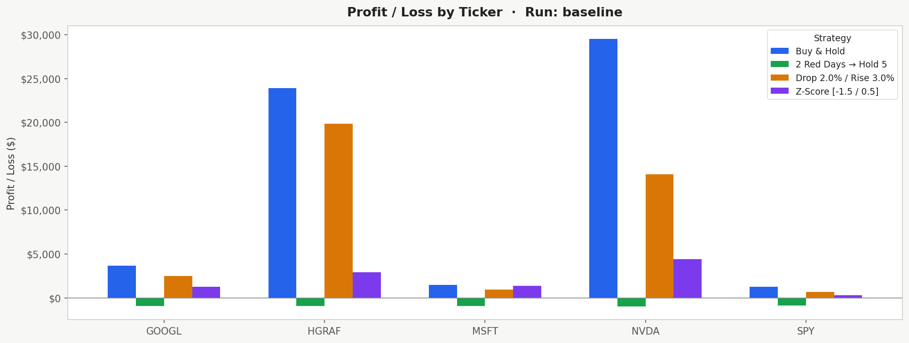
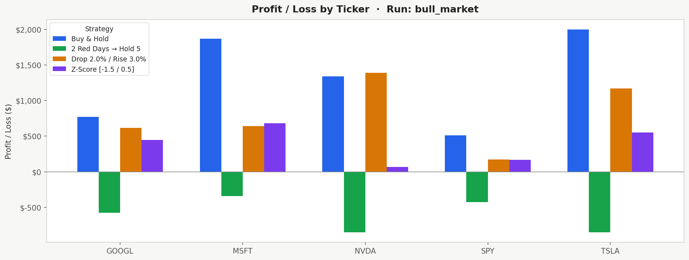
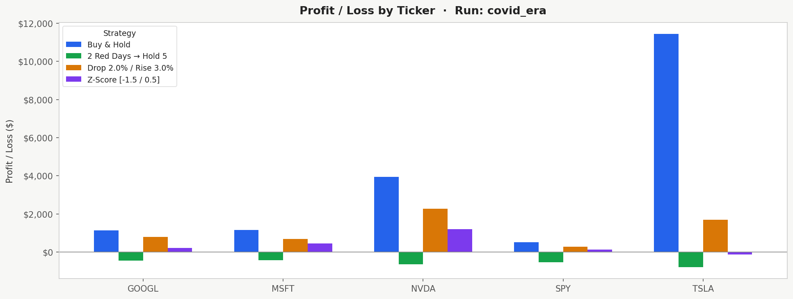
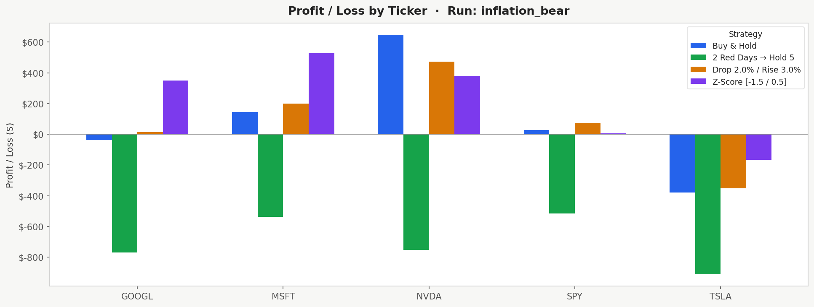
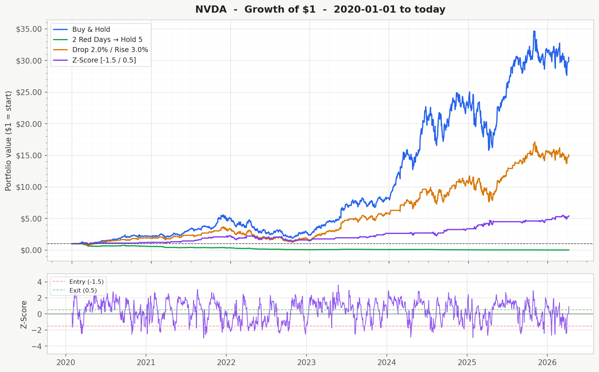
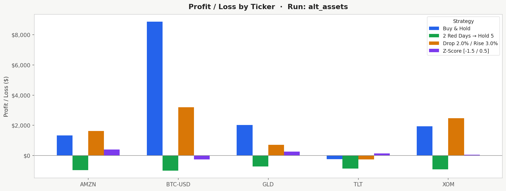

# Algo Trading Backtest

A Python backtesting framework that tests three mean-reversion trading strategies against buy-and-hold across multiple asset types, market regimes, and parameter settings.

Built with `yfinance`, `pandas`, `numpy`, `matplotlib`, and `seaborn`.

-----

## Research Question

Do simple mean-reversion trading rules work in practice, and does the answer change depending on the asset type or market environment?

-----

## Strategies

|Strategy                  |Logic                                                                                                |
|--------------------------|-----------------------------------------------------------------------------------------------------|
|**Buy & Hold**            |Buy at the start and hold the whole time. Benchmark.                                                 |
|**Red Days**              |Buy after N consecutive down days, hold for X days                                                   |
|**Drop / Rise**           |Buy on a single-day drop of at least X%, sell when price rises Y% from entry                         |
|**Z-Score Mean Reversion**|Buy when the rolling Z-score is very negative (price is statistically cheap), sell when it normalizes|

-----

## Tickers

|Ticker|Type                   |
|------|-----------------------|
|SPY   |Stable growth ETF      |
|MSFT  |Large-cap growth       |
|GOOGL |Large-cap growth       |
|NVDA  |High-risk growth       |
|HGRAF |Speculative penny stock|

Alternative universe tested: `GLD, TLT, BTC-USD, XOM, AMZN`

-----

## Methodology

1. Pull historical daily close prices from Yahoo Finance
1. Compute daily returns and cumulative portfolio growth
1. Apply each strategy’s buy/sell logic with configurable transaction costs
1. Compare each strategy to buy-and-hold using return and risk metrics
1. Repeat across multiple tickers, parameter settings, and date ranges

The same parameters are applied across all tickers with no per-stock tuning, so results are directly comparable.

-----

## Metrics Tracked

- Final portfolio value and profit/loss
- Total return and annualised return
- Sharpe ratio (risk-adjusted, uses current risk-free rate)
- Calmar ratio (annualised return divided by max drawdown)
- Average daily return and daily volatility
- Max drawdown
- Signal count, completed trades, win rate

-----

## Analysis Cells

Beyond the main backtest, the notebook includes four additional analysis cells that run after the main results:

**Strategy Correlation** — heatmap showing how correlated the three strategies are with each other per ticker. Strategies with correlation above 0.7 are not meaningfully diversifying each other.

**Parameter Sensitivity Grid** — automatically tests Drop/Rise across 25 combinations of buy drop and sell rise thresholds. A robust strategy shows positive Sharpe across a range of parameter values. If only one cell is green, the results are likely overfitted.

**Walk-Forward Test** — splits each ticker’s data 70/30. Parameters are chosen on the training set and then applied to the unseen test set. If a strategy holds up on the test set, that’s genuine signal. If it collapses, it was memorizing the past.

**Monte Carlo Simulation** — shuffles the actual trade returns 1000 times and checks whether random chance could have produced the same result. p-value below 0.05 means the result is statistically meaningful. p-value above 0.15 means it could easily be luck.

-----

## Findings

### Baseline (2020 to today, standard parameters)

[](charts/baseline_profit_loss_bar.png)

Buy and hold outperformed all active strategies, largely driven by NVDA (+2,850%) and GOOGL (+368%) over the period. Drop/Rise was the closest active competitor, achieving a 93.7% win rate across completed trades. Red Days lost money on every single ticker.

### Parameter Sensitivity: Baseline vs Long-Term vs Short-Term

Running the same tickers from 2020 to today with different parameter settings showed that the Drop/Rise strategy is fairly robust across configurations. The short-term aggressive run (1% drop, 1.5% rise) produced higher raw returns on volatile tickers like HGRAF but with more noise. The long-term patient run (3% drop, 5% rise) was more selective and generated fewer trades. Red Days failed under all three parameter sets.

### Bull Market (2017 to 2020)

[](charts/bull_market_profit_loss_bar.png)

In the calm pre-COVID bull run, buy and hold dominated across all tickers. Drop/Rise still produced positive returns but could not match the consistent upward momentum of the market. Z-Score was competitive on MSFT and GOOGL but underperformed on NVDA and TSLA where price trends were stronger than mean-reversion patterns.

### COVID Era (2020 to 2021)

[](charts/covid_era_profit_loss_bar.png)

The COVID crash followed by a V-shaped recovery was a strong environment for Drop/Rise. Sharp single-day drops during the March 2020 crash created exactly the kind of entry signals the strategy looks for, and the rapid recovery meant those trades closed profitably. TSLA and NVDA showed the biggest gains. Red Days still lost money across the board.

### Inflation and Bear Market (2022 to 2023)

[](charts/inflation_bear_profit_loss_bar.png)

This was the most notable regime. Buy and hold averaged only +8% across tickers while Drop/Rise averaged +17% and Z-Score averaged +22%. Z-Score achieved a Sharpe of 1.12 on MSFT and 0.77 on GOOGL, compared to buy-and-hold Sharpes of 0.37 and 0.16 for the same tickers. Choppy, two-sided price movement in bear markets is exactly the environment mean-reversion strategies are designed for.

[](charts/baseline_NVDA_comparison.png)

### Alternative Assets (GLD, TLT, BTC-USD, XOM, AMZN)

[](charts/alt_assets_profit_loss_bar.png)

Drop/Rise averaged +155% on the alternative universe, mostly driven by BTC and XOM. XOM was the standout: Drop/Rise consistently beat buy and hold on Exxon, likely because energy stocks have more predictable cyclical volatility than tech stocks. TLT (long-term bonds) was the worst performer across all strategies, reflecting the sustained rate-hike-driven decline in bond prices over the period.

### Transaction Cost Stress Test

Comparing 0%, 0.1%, and 0.5% per-trade costs, Drop/Rise returned 7.23%, 7.61%, and 7.28% respectively. Almost no difference. The strategies do not trade frequently enough for costs to compound significantly, which suggests they are robust to realistic friction.

-----

## The Red Days Problem

Worth calling out separately: the consecutive red days strategy produced negative returns in 100% of cases across all 9 runs, all tickers, and all parameter variations. Average total return was -80.6%. The strategy essentially keeps buying into downtrends in trending markets and gets whipsawed in volatile ones. This is a meaningful null result and one of the clearest takeaways from the project.

-----

## Limitations

- No position sizing, strategies are fully invested or fully in cash
- Parameters were selected manually, not optimised
- HGRAF penny stock data from Yahoo Finance may not be reliable
- No short selling, strategies only go long
- All tickers are known successful companies, a random universe would likely show weaker results

-----

## How to Run

```
git clone https://github.com/Owl-29/algo-trading-backtest.git
cd algo-trading-backtest
pip install yfinance pandas numpy matplotlib seaborn
jupyter lab Algo_Trading_Backtest.ipynb
```

Run Cell 3 first with your inputs. Then run any of the four analysis cells in any order — they all use variables created by Cell 3.

The notebook prompts for all inputs at runtime. Results append to the master CSV so multiple runs accumulate over time.

-----

## Output Files

|File                            |Contents                                            |
|--------------------------------|----------------------------------------------------|
|`master_strategy_summary.csv`   |All results, one row per ticker per strategy per run|
|`master_strategy2_trade_log.csv`|Individual trade log for Drop/Rise                  |
|`master_strategy3_trade_log.csv`|Individual trade log for Z-Score                    |
|`charts/`                       |PNG charts for every ticker and run                 |

-----

*Undergraduate research project, Lehigh University*